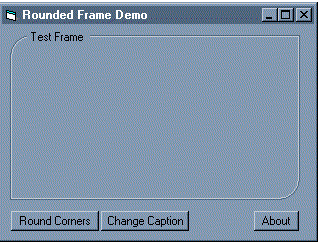



## Rounded Frames

### Description

This sample is a great starting point for a custom control. What this source code shows is how to use various shape controls and pictureboxes to create a custom frame container that has the ability to use rounded corners.

This code is well commented. Most of this code can be easily migrated to an ActiveX control. See the screenshot for an example of its appearance.

Feel free to leave me feedback, and I will try to respond. Don't forget to vote if you like it!
 
### More Info
 
Will work in Visual Basic 5.0, as long as you remove the RETAINED key in the .vbp file.

             |
---                |---
**Submitted On**   |2000-07-25 15:20:10
**By**             |[Joseph M\. Ferris](https://github.com/Planet-Source-Code/PSCIndex/blob/master/ByAuthor/joseph-m-ferris.md)
**Level**          |Intermediate
**User Rating**    |4.7 (52 globes from 11 users)
**Compatibility**  |VB 5\.0, VB 6\.0
**Category**       |[Custom Controls/ Forms/  Menus](https://github.com/Planet-Source-Code/PSCIndex/blob/master/ByCategory/custom-controls-forms-menus__1-4.md)
**World**          |[Visual Basic](https://github.com/Planet-Source-Code/PSCIndex/blob/master/ByWorld/visual-basic.md)
**Archive File**   |[CODE\_UPLOAD81547252000\.zip](https://github.com/Planet-Source-Code/joseph-m-ferris-rounded-frames__1-10067/archive/master.zip)

